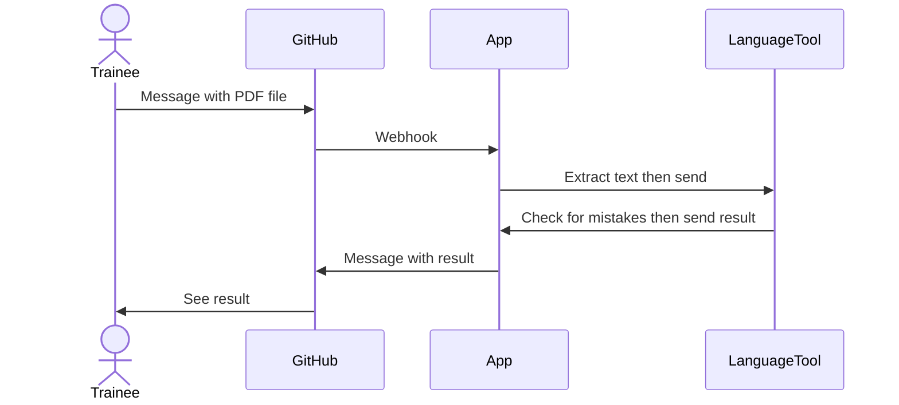

# PD Grammar Bot

## What is this?
Checking for grammar, spelling and punctuation mistakes in PD coursework before submitting is very important. Trainees are not using extensions in word processing software to do this and volunteers are having to check manually which takes up a lot of their time. The PD Grammar Bot is a GitHub app which automatically checks PD coursework submissions for mistakes:
- After forking a CYF repo containing PD coursework issues, the user installs the app in the forked repo through a link.
- Trainees download their PD coursework as a PDF file from Google Docs.
- They upload the file to the message box on the PD courework GitHub issue page and submit.
- Ater submitting, a webhook is sent to the GitHub app.
- If there is a file URL in the message, the app extracts the text from the file then sends it to a self-hosted LanguageTook instance running inside a Docker container on AWS.
- LanguageTool checks the text for mistakes then sends the result back to the app.
- The app creates a new message for the issue with the result.
- This process is repeated till there are no more mistakes.

## Architecture
The sequence diagram below shows the series of events and calls.

## Tech Stack
- Node.js
- Probot
- Octokit
- Docker
- Jest
- MSW
- Netlify
- AWS

## Deployment
- GitHub as a Netlify serverless function.
- Self-hosted LanguageTool instance inside a Docker container on AWS.